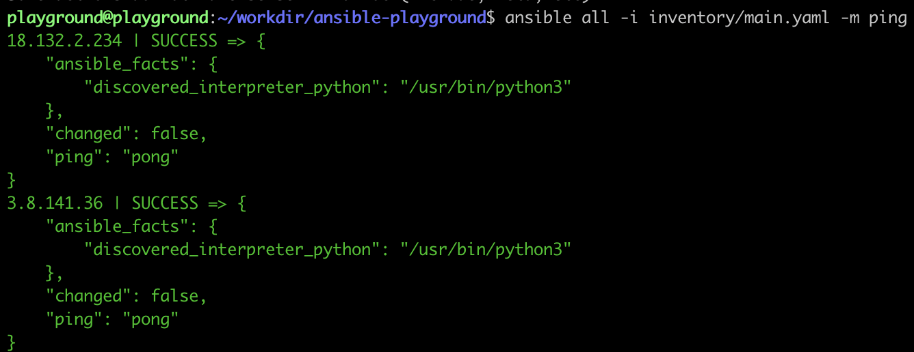

# Ansible Playground

## Lab

In this lab we are going to use ansible to install and configure consul in a server client grouping.

### Part 1. Defining inventory

Set up the inventory file with the hosts that we will be using for the playground and structure into groups
Show that the inventory is valid by running the ping command.

1. There is a template provided in the `invetory/main.yaml` that we need to populate some values in. We need to add the IP of our target host server and the IP of our current server along with the user for Ansible ssh with and password that it can use to privilege escalation. This will have been provided to you in the labs portal. The ips will replace the `0.0.0.0` values in the current file.

2. To test that the inventory has been set up correctly we can run the following command.
```
ansible all -i inventory -m ping
```

This should return something like the following


### Part 2. Base set up 

Use ansible to install required system packages and define the user and directories on the remote hosts.
Demonstrate deleting one of the directories and getting ansible to recreate it.

1. We first need to make sure any packages that we need on the server are installed this can be done uing a packages module. This will be done in the `roles/base/tasks/main.yaml` file. To do this we set up a task give it and give it a name. Then define what module that we want to use, in this case packages, and finally filla out the paramters for that task. All of this put together will add the following block to the file.
```
- name    : Install required packages
  package :
    name  : unzip
    state : present

```

2. Now that we have teh content of our first role defined we will wan to add that to our playbook `main.yaml` that sits at the top level of this directory. When adding the role we will need to define the hosts that it should be applied to as well as any privialge esclation if required. This results in adding the following block of code.
```
- name: Consul base
  hosts: all
  become: true
  roles:
    - base
```

3. The next step is adding the group that will grant access to the items required for running the program. This time we will be using the group module and we only need to configure one atribute the group name. In `roles/consul-common/tasks/main.yaml` add the following block of code.

```
- name  : Create consul group
  group :
    name : "{{ consul_group }}"
```

4. Now that we have a group we will want a user as well. This is achivied in a verry similar manner using the user module. Add this block directly after the block added in step 1.
```
- name : Create consul user
  user :
    name : "{{ consul_user }}"
```

5. With the user and group set up we can build a directory structure with the correct ownership. For this as we want to create multiple directories with the same owenership and permissions we can use the `with_items` atribute alongside our file module that allows us to create multipe items with a single task. Add the below block after the following task.
```
- name      : Create directories for consul
  file      :
    path  : "{{item}}"
    state : directory
    owner : consul
    group : consul
    mode  : "0750"
  with_items :
    - "{{ consul_config_dir }}"
    - /opt/consul
    - /opt/consul/data
    - "{{ consul_tls_dir }}"
``` 

6. Now that we have the base of what we want to run in the `consul-common` role we can add it to our main playbook as anther role as we did in step one.
```
    - consul-common
```

7. To see of what we have done so far works we can run the 
```
ansible-playbook -i inventory main.yaml
```

### Part 3. Pulling in data from outside of Ansbible 

Download and unzip Consul binaries using the uri modules

1. We need to pull the binary that we are going to be running from an external source, in this case releases.hashicopr.com. To do this we will use the URI module, inserting the following block into `roles/consul-common/tasks/main.yaml` after the create Consul user task.
```
- name                   : Download consul binary
  ansible.builtin.get_url :
    url  : https://releases.hashicorp.com/consul/{{ consul_version }}/consul_{{ consul_version }}_linux_amd64.zip
    dest : /tmp/consul{{ consul_version }}.zip
```

2. Now that we have the binary downloade to the tmp derectory we need to exspand it ot a useful location location. This can be done with the unarchive module by adding the following block below the part added in step 1.
```
- name      : Expand consul binary
  unarchive :
    src        : /tmp/consul{{ consul_version }}.zip
    dest       : /usr/local/bin
    remote_src : true
```

### Part 4. Templating

Set up a service file for Consul using the J2 templating available in Ansible.

1. Paste the below block at the end of the `roles/consul-common/tasks/main.yaml` file:
  ```
- name     : Create consul service file
  template :
    src  : consul.service.j2
    dest : /etc/systemd/system/consul.service

- name            : Enable consul service
  service :
    state : started
    name  : consul.service
  ```

2. Add the contents for the service template to the `consul.service.j2` in the `templates` directory:

```
[Unit]
Description="HashiCorp Consul - A service mesh solution"
Documentation=https://www.consul.io/
Requires=network-online.target
After=network-online.target
ConditionFileNotEmpty={{ consul_config_dir }}/common-config.hcl

[Service]
User=consul
Group=consul
ExecStart=/usr/local/bin/consul agent -config-dir={{ consul_config_dir }}
ExecReload=/bin/kill --signal HUP $MAINPID
KillMode=process
KillSignal=SIGTERM
Restart=on-failure
LimitNOFILE=65536

[Install]
WantedBy=multi-user.target
```

3. We will also want to template out a config file for this service file to use. This will be done by creating a play just above the previous one created in step 1.
Add the following:
```
- name     : Create common consul config file
  template :
    src  : common-config.hcl.j2
    dest : "{{ consul_config_dir }}/common-config.hcl"
```

4. Add the contents for the config template to the `common-config.hcl.j2` in the `templates` directory:
```
retry_join = ["{{ query('inventory_hostnames', 'consul_servers') | join('","')}}"]
encrypt = "bGlrZSwgc2hhcmUsIHN1YnNjcmliZSBhbmQgYmVsbAo="
bind_addr = "{{ ansible_default_ipv4.address }}"
```

5. We also have more templating in our `consul-client` and `consul-server` roles. We will also want to add these to our main playbook now specifying the host group to target.
Add the following plays below the `Consul base` play:
```
- name: Set up servers
  hosts: consul_servers
  become: true
  roles:
    - consul-server

- name : set up clients
  hosts : consul_clients
  become : true
  roles : 
    - consul-client
```

### Part 5. Handlers

Set up a handler for Consul so that if the config is changed in any of the roles the Consul service is restarted.
For this step we will firstly be working in `roles/consul-common` and then `roles/consul-client/tasks/main.yaml` & `roles/consul-server/tasks/main.yaml`. 

1. Create a handler which will restart the Consul service if any config changes are made that might affect it.
- Add the below block to `roles/consul-common/handlers/main.yaml`: 
```
  - name    : Restart consul service
    service :
      name    : consul.service
      state   : restarted
      enabled : true
```

2. Notify the handler to restart the Consul service by adding the `notify` statement to any play that would require a service restart.
This will call the handler to trigger the restart at the end of that role group execution if a change is made by that play.

- In the `roles/consul-common/tasks/main.yaml` file, add the below line to the following tasks; `Expand consul binary`, `Create common consul config file` and `Create consul service file`:
```
    notify    : Restart consul service
```
- This should be indented at the same level as `name`.

3. The handler has already been created for the `consul-client` and `consul-server` roles. We just need to add the `notify` statements.
- Add the below `notify` statement:
```
    notify   : Restart consul service
```
- To the following files:
  - `consul-client` role tasks file in `roles/consul-client/tasks/main.yaml` 
  - `consul-server` role tasks file in `roles/consul-server/tasks/main.yaml`

### Part 6. Generate encryption key

Use command block to show that you can just execute custom commands on the server if there isn't a module available.

This needs to be done in the `consul-common` role in: `roles/consul-common/tasks/main.yaml` as it is required for the config files generated as part of the role

1. To store the encryption key, we're currently placing in a file on the server. So before doing anything, we want to check whether this file already exists.
To do this, we will use the `stat` module to register a variable (using the `register` attribute) for later plays.
Place the following block after the `Create directories for consul` play:
```
- name     : Check for encryption key
  stat     :
    path : "{{ encryption_key_file }}"
  register : key_file_present 
  when     : ("consul_servers" in group_names)
```

2. If there is not an encryption key already present, we will want to generate a new one.
This is done through a Consul command in which we will use a `shell` command to execute directly on the server.
Add the following block directly below the block from step 1:
```
- name    : Generate encryption key
  shell   : consul keygen
  register : consul_encryption_key
  when     : not key_file_present.stat.exists and ("consul_servers" in group_names)
  run_once : true
```

3. If we have generated a new encryption key, we want to store it in a file on one of the servers.
We can make use of the `copy` module to achieve this.
Add the following block directly below the block from step 2:
```
- name     : Store in local file
  copy     :
    content : "{{consul_encryption_key.stdout}}"
    dest    : "{{ encryption_key_file }}"
    mode    : 0600
  when     : not key_file_present.stat.exists and ("consul_servers" in group_names)
  run_once : true
```

4. Register the contents of the file (that contains the encryption key) to a variable.
This should follow directly from step 3.
```
- name     : Cat encryption key
  shell    : cat {{ encryption_key_file }}
  register : consul_encryption_key
  when     : ("consul_servers" in group_names)
  run_once : true
```

5. We want to update the value in our common config template (in `templates/common-config.hcl.j2`) to use the new encryption key that we're now dynamically generating.
Replace:
```
encrypt = "bGlrZSwgc2hhcmUsIHN1YnNjcmliZSBhbmQgYmVsbAo="
```
With:
```
encrypt = "{{ consul_encryption_key.stdout }}"
```

### Part 7. TLS time 

Generate and pass around TLS files so that the service can talk in an encrypted manner.

Add a `consul-tls` role to the main playbook `main.yaml` (in root directory):
```
- name: Consul internal networking encryption
  hosts: all
  become: true
  roles: 
    - consul-tls
```

In `roles/consul-tls/tasks/main.yaml` start adding the tasks to:

1. Generate TLS directories
```
- name : Create TLS directories
  file :
    path  : "{{ consul_tls_dir }}"
    state : directory
    owner : "{{ consul_user  }}"
    group : "{{ consul_user }}"
    mode  : "0750"
```

2. Initialise the Consul Certificate Authority
```
- name: Initialise consul's CA
  command:
    cmd: consul tls ca create
    creates: consul-agent-ca-key.pem
    chdir: "{{ consul_tls_dir }}"
  run_once: true
  when: ("consul_servers" in group_names)
  notify: Restart consul service
```

3. Create the required Consul client and server certificates
```
- name     : Generate server certs
  command  :
    cmd     : consul tls cert create -server 
    creates : dc1-server-consul-0-key.pem
    chdir   : "{{ consul_tls_dir }}"
  run_once : true
  when: ("consul_servers" in group_names)
  notify: Restart consul service

- name: Change the key permissions
  file:
    path: "{{ consul_tls_dir }}/dc1-server-consul-0-key.pem"
    group: "{{ consul_user }}"
    mode: "0640"
  run_once: true
  when: ("consul_servers" in group_names)
  
- name: Generating client certificates
  command:
    cmd: consul tls cert create -client 
    creates: dc1-client-consul-0-key.pem
    chdir: "{{ consul_tls_dir }}"
  run_once: true
  when: ("consul_servers" in group_names)

- name: Change dc1-client-consul-0-key.pem permission
  file:
    path: "{{ consul_tls_dir }}/dc1-client-consul-0-key.pem"
    group: consul
    mode: "0640"
  run_once: true
  when: ("consul_servers" in group_names)
```

4. We now need to transfer the client certificates over to the client
```
- name: Archive the tls directory for client
  archive:
    path: 
      - "{{ consul_tls_dir }}/dc1-client-consul-0.pem"
      - "{{ consul_tls_dir }}/dc1-client-consul-0-key.pem"
      - "{{ consul_tls_dir }}/consul-agent-ca.pem"
    dest: "{{ consul_tls_dir }}-client.tgz"
    mode: "0600"
  run_once: true
  when: ("consul_servers" in group_names)

- name: Register tls zipped directory
  command:
    cmd: cat {{ consul_tls_dir }}-client.tgz
  register: CLIENTTLS
  run_once: true
  when: ("consul_servers" in group_names)

- name: Load TLS into every Consul Client
  copy:
    dest: "{{ consul_tls_dir }}-client.tgz"
    content: "{{ CLIENTTLS.stdout }}"
    mode: "0600"
  when: ("consul_clients" in group_names)

- name: Unzip the client certificates
  unarchive:
    src: "{{ consul_tls_dir }}-client.tgz"
    dest: "{{ consul_tls_dir }}"
    remote_src: true
    creates: "{{ consul_tls_dir }}/dc1-client-consul-0-key.pem"
  when: ("consul_clients" in group_names)
  notify: Restart consul service
```

Run the ansible playbook to apply your configuration
```
ansible-playbook -i inventory main.yaml
```


## Health checks 

The health checks in for the consul service have been provided so we can see the progress we are making towards the desired state. Test driven development and all of that jazz.